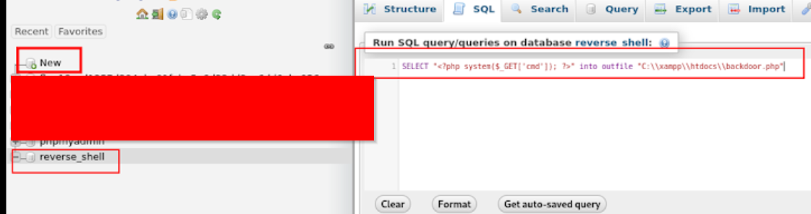

# WHAT DO YOU SEE?

**NB:** 

- **Scan more than four times with rustscan to make sure you got all the ports, then scan all the ports more than four times with nmap**
- **Before doing all of this always check for known vulnerabilities for any service, it might save you time**
- **There are some things you just wouldn’t know due to inexperience**

### Ports and Services

### NOTHING

- Scan all ports multiple times.
- Or use rustscan / masscan to find open ports then use nmap to probe them more than twice.
- If you see anything that will allow logins i.e SSH, just try it, i could print out a hint.

### FTP

- If you have the service version then use Metasploit or just google, there might be something there.
- Try anonymous login ‘ ftp [ip] ‘.
- Don’t forget to try hydra.

### SSH

- Try Hydra .
- If you find the ‘id_rsa’ don’t forget to use ‘chmod 600 id_rsa’ on it .
- No login creds?, just try anything, you might get a hint

### HTTP / HTTPS

- Use nikto on the site .
- Use subfinder.
- User whatweb.
- Look in the site
    - See a pic? - Steganography ( steghide or stegseek)
    - Check page source code
    - See a login page?
        - Any known Default logins for the service.
        - Any random default login for usual sites.
        - Hydra to brute force the login
        - Try SQL injection if SQL service is running on the system. Depending on the service the commands you try to run for the SQLI may change. Use Gemini and stuff.
        - Look for any know *vulnerabilities* .
        - If you find a vulnerability then find it’s exploit script or just exploit it yourself.
        - Try FFUF or DIRBUSTER to find any hidden page that can help.
    - Does the site allow file upload and file viewing?
        - Then upload a webshell and launch it on the site.
    - Does the site allow unauthenticated query / movement?
        - Host a webshwll and query it.
- XML being used when launching burpsuite / file handling
    - Use an xml payload to read files there
- A search bar / A comment box / Any Input Box
    - Try XSS , it won’t hurt to try this on a log in screen either
- A link not of the http site?
    - Zone transfer
    - Hosts list update and enumerate the site
    - dig / nslookup

### DNS

- Use Dig or NsLookup to look around the DNS records ( dig @[ip] [example.com](http://example.com) ANY)
- Something useful might be in the records like in the txt record or something similar
- Try doing zone transfer (either any random creative stuff or a clue you found somewhere) and updating your local hosts list and searching up the site, there might be a clue there.
- Use dnsenum to check if zone transfer is possible

### NFS

- Show the available mounts, use rpcinfo if possible to get the version
- Look for something useful
- Try to see if there is root squashing
    - If Not then , Upload a shell spawning script to the NFS, as root set its owner and group to root, set the SUID bit set ( chmod +s)  , SSH into the low privileged , go the the NFS, run the shell spawner ( it will spawn a root shell because the SUID bit set makes the script run using the privileges of the owner / group.
- Check for an ‘id_rsa’ there, then try SSH, Don’t forget to use ‘chmod 600 id_rsa’ on it if you find one .

### SMB / NetBios-ssn / Microsoft-ds

- Use “enum4linux “ to enumerate the SMB to find useful info ( OS, version, shares , credentials ).
- Check if anonymous login is possible using ‘ smbclient ’ .
- Look for a known vulnerability and exploit it.
- There might be an ‘id_rsa’ there, use it for the SSH, Don’t forget to use ‘chmod 600 id_rsa’ on it if you find one .

### ThinVNC

- That is a remote desktop solution. There might be more remote desktop services on the system.
- Try  auxiliary/scanner/http/thinvnc_traversal
- The ThinVNC web is slow so try using rdesktop .

### RPCBIND

- Run “rpcinfo -a [ host ]” to see the available things you could use and their version for easy connection

### TELNET / An unassigned TCP port?

- This might or might not be telnet.
- Try connecting to it ‘ telnet [ ip ] [ port ]’
- Keep a note of information you find during your enumeration stage, so you can refer back to it when you move on to try exploits.

### SMTP

- Run smtp_version from Metasploit to get more information on the smtp for a more precise attack
- Run smtp_enum to look around the email service and get some useful info, don’t forget to set the usernames wordlists , seclists is starting to grow on me.
- If you have a username then use Hydra on any available service.

### MySQL

- If you see XAMPP then there’s probably SQL on the system
- You might have some credentials you got from other activities so you could try connecting through mysql to check if the credentials work depending on the error msg you get. **OR JUST USE HYDRA**
- If you have some creds, try using the ‘mysql_sql’ or ‘mysql_hashdump’ or ‘mysql_schemadump’ module in metasploit. Just try whatever you can bro, i did this before the memory loss , you should be able to as well.

### RTSP

- That is a site, go to it

### THE TARGET SHELL  / TIME FOR PRIVESC

- Run (Linpeas , Linux Exploit Suggestion Script [ les ] , Linux Smart Enumeration [ lse ] or anyother ones ) and use your head. If possible don’t even use Linpeas.
- Remember to use the reverse shell generator to help you out.
- And use GTFOBins to find out how you can exploit misconfigured settings and permission in the Unix system you are in. Use lolbas if the system is a windows system.
- If Linpeas doesn't see anything specific just look for less specific stuff, scavenge .

### NO RESPONSE TO COMMANDS ON TARGET MACHINE

- Try pinging yourself while listening on your own port ⇒  sudo tcpdump -i tun0 icmp
- If the pinging works, i think it is time for a nc mkfifo reverse shell.

### A file to edit

- Use vim 🙂 , you’ll sweat but it’s the safest, i messed up trying to use nano and ed, just use vim.
- You could always just cat it out then copy the output and edit it locally then echo it back into the file

### A LONG STRING OF NONSENSE

- That is encrypted / encoded gold.

### Logged into phpmyadmin

- Create a new database and put php shell code into the sql tab
- this

- then this as part of the url you go to
    
    
    
- If  you want a payload for it do some research, only base64payloads are reliable for windows.

But can you read story books normally? , it’s not  disorder you have, your mind is not arranged